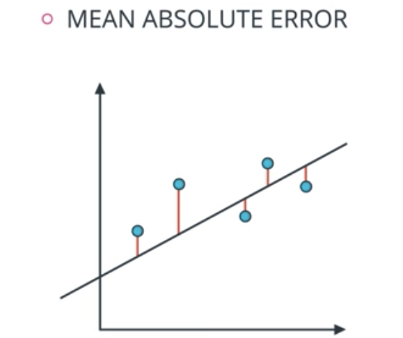
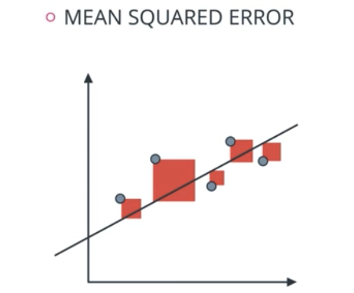
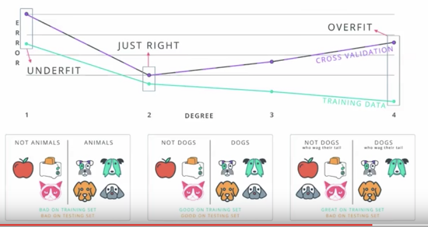
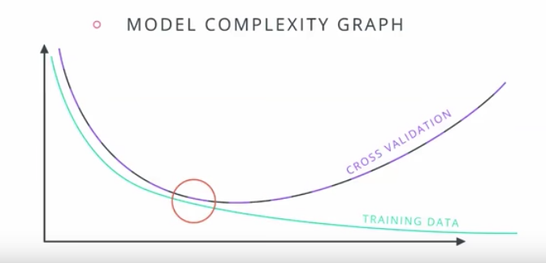
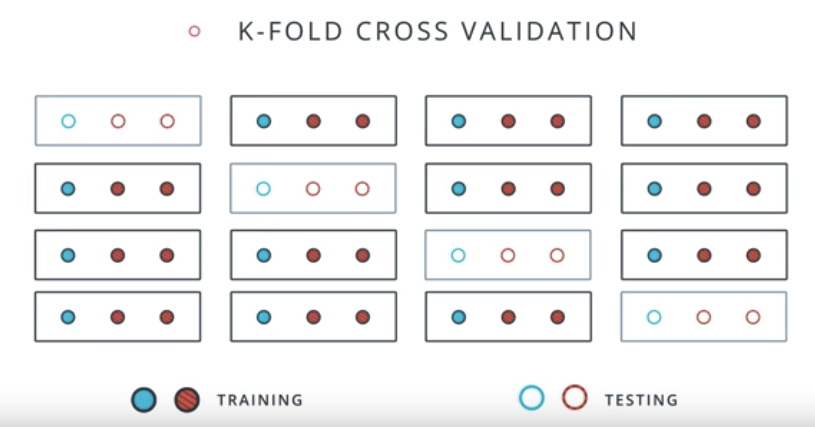

# Model Evaluation and Validation
1. Regression returns a numeric value. Classification returns a state.
1. Test model to see if it's good.
1. Overfitting may result in bad generalization of data. E.g. perfect curve that fits every data points as opposed to a straight line. But when introduced a new point, the overfitting curve may not generalize as well as the straight line. Find a model that generalizes well.
1. Testing - split data into two sets: training set and testing set.
1. Go for smaller errors.
1. Use `sklearn`:
```
from sklearn.model_selection import train_test_split
X_train, y_train, X_test, y_test = 
train_test_split(X,
				 y,
				 test_size = 0.25)
```
1. Thou shalt never use your testing data for training.
1. Confusion: 

1. Answers for above are: 6 TP, 5 TN, 2 FP, 1 FN
1. Accuracy = Correctly classified points / All points
1. Mean Absolute Error:

```
from sklearn.metrics import mean_absolute_error
from sklearn.linear_model import LinearRegression
classifier = LinearRegression()
classifier.fit(X, y)
guesses = classifier.predict(X)
error = mean_absolute_error(y, guesses)
```
1. Mean Squared Error In sklearn:

```
from sklearn.metrics import mean_squared_error
from sklearn.linear_model import LinearRegression
classifier = LinearRegression()
classifier.fit(X, y)
guesses = classifier.predict(X)
error = mean_squared_error(y, guesses)
```
1. R2 Score: comparing a model to a simplest possible model.
1. The simplest possible model is to take the average of all the values and draw a horizontal line through them and calculate the mean squared errors for this model.
1. We would hope that the mean squared model(mse) from the simple model is larger than that of linear regression model.
1. R2 score =  1 - error of regression model/ error by simple model 
1. Model is not good then errors should be similar hence R2 score is close to 0.
1. Good model has higher R2 score. The closer to 1 the better.
```
from sklearn.metrics import r2_score
y_true = [1, 2, 4]
y_pred = [1.3, 2.5, 3.7]

r2_score(y_true, y_pred)
```
1. Types of Errors:
	1. Underfitting - oversimplifying a problem
	1. Overfitting - overcomplicating a problem
1. Underfitting(High bias) - doesn't do well during training set - error due to bias.
1. Overfitting(High variance) - does well in training set but tends to memorize it instead of learning the characteristics of it.


1. Testing is done by separating data into a training set and a testing set. This is not always ideal as we seem to be throwing away some data that could be useful for training our algorithm.
1. K-Fold Cross Validation - break data into K buckets (say 4), train the model K times (4 times in this case) each time using a different bucket as testing set and remaining points as training set. Then we average the results to get a final model.
```python
from sklearn.model_selection import KFold
kf = KFold(12,3, shuffle = True) # this randomize the data

from train_indices, test_indices in kf:
	print train_indices, test_indices
```

