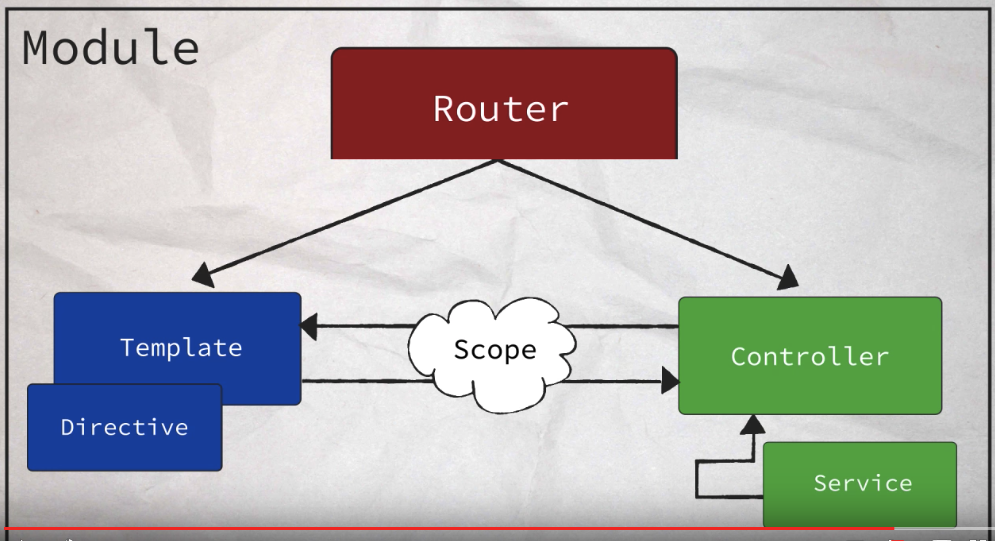

# Front End Frameworks
## Intro
1. Frameworks are basically to solve browser compatability when it comes to using AJAX.
1. MVC - Model, View, Controller
	1. Model - data model: user info, data etc.
	1. View - what user sees an interacts with
	1. Controller - the brain of the app, the logics and stuff
1. Angular and Ember allows you to create your own custom HTML elements.
1. Updating the DOM - DOM insertion and manipulation is an extremely slow process. Some frameworks create virtual DOM in memory, and perform all of the necessary updates or deletions to this in-memory structure. Then it will convert VirtualDOM to real DOM and replace the existing content.
1. Fullstack Frameworks live on both client and the server - hence you can handle things like data streaming. E.g. Meteor uses web sockets to keep an open connection between client and server. This provides for faster communication and a smoother user experience.
1. [Choosing the right JS Framework for the job](https://www.lullabot.com/articles/choosing-the-right-javascript-framework-for-the-job)

## Examine a Framework's Source
1. Backbone uses Underscore for templating.
1. [Set Breakpoints](https://developers.google.com/web/tools/chrome-devtools/javascript/add-breakpoints?hl=en/)
1. [How to step through your code](https://developers.google.com/web/tools/chrome-devtools/javascript/step-code?hl=en)
1. [How to watch variables in Sources](https://developers.google.com/web/tools/chrome-devtools/javascript/watch-variables?hl=en)
1. Literal format vs. constructor function:
```JavaScript
	// literal
	var obj1 = {};
	var arr1 = [];
	var func1 = function() {};

	// constructor
	var obj2 = new Object();
	var arr2 = new Array();
	var func2 = new Function();
```
1. Constructor is less readable, slower and harder to work with but it can dynamically create a function at run time which literal format can't:
```JavaScript
	function make(adjective) {
		return new Function('noun', "return noun[0].toUpperCase() + noun.slice(1) + 'is " + adjective + "!'");
	}

	var isFun = make('fun');

	isFun('Coding'); // Coding is fun
	isFun('climbing'); // Climbing is fun
```
```JavaScript
	function numLetters(letter) {
		return new Function("num", 
			"var output = '';" + 

			"for (i = 0; i < Math.round(num); i++) {" + 
				"output += '" + letter + "';" + 
			"}" + 
			"return output;"
		);
	}

	console.log(numLetters('a')(4.3)) // 'aaaa';
```
1. template function that I came up with:
```JavaScript
function template(str, delims) {
  // Fill this in
	var d = {
		open: "*(",
		close: ")*"
	};
  
  	var indices = [];
  	var argumentsArr = [];
 	
 	if (delims) d = delims;

	var startPos = str.indexOf(d.open);
	var endPos = str.indexOf(d.close);

	while (startPos !== -1) {
	  	var s = str.substring(startPos + d.open.length, endPos);
	  	startPos = str.indexOf(d.open, startPos + 1);
		endPos = str.indexOf(d.close, endPos + 1);
		argumentsArr.push(s);
	}

	var templateString = '"' + str.split(d.open).join('" +').split(d.close).join('+ "') + '"';
	templateString = "var s = " + templateString + "; var count = 0; while(count < repeat) { console.log(s); count++;} return s;" ;
	
	argumentsArr.push("repeat");
	
  return new Function (argumentsArr.join(','), templateString);
}
var string = "Hi, my name is Richard. And I *( emotion )* this *( thing )*!";
var logResult = template( string );
logResult( 'love', 'ice cream', 2 );
var string = "Is <<! thing !>> healthy to <<! action !>>?";
var logResult = template( string, {open: '<<!', close: '!>>'} );
logResult( 'ice cream', 'consume', 7 ); // logs the message "Is ice cream healthy to consume?", seven times
var string = "blah blah blah";
var logResult = template( string );
logResult( 'love', 'ice cream', 10);
```
1. The instructor solution:
```JavaScript
var template = function(text, options) {
	var delimiter = {
		open: "*(",
		close: ")*"
	}
	var templateString = [];
	var i = 1;
	var closingDelimiterLoc = 0;
	var functionArguments = [];
	var theVariable, remaining;

	var wrapInQuotes = function (text) {
		return "'" + text + "'";
	};

	for (var key in options) {
		if (options.hasOwnProperty(key)) {
			if (options[key] !== undefined) {
				delimiter[key] = options[key];
			}
		}
	}

	var segments = text.split(delimiter.open);
	var numOfSegments = segments.length;

	templateString.push(wrapInQuotes(segments[0]));

	while (i < numOfSegments) {
		closingDelimiterLoc = segments[i].indexOf(delimiter.close);

		theVariable = segments[i].slice(0, closingDelimiterLoc);
		functionArguments.push(theVariable);
		templateString.push(theVariable);

		remaining = segments[i].slice(closingDelimiterLoc + delimiter.close.length);
		templateString.push(wrapInQuotes(remaining));
		i++;
	}

	functionArguments.push('times');
	templateString = 'while(times--) {console.log(' + templateString.join('+') + ')}';
	return new Function(functionArguments.join(','), templateString);
};
```
1. Custom Events
```JavaScript
// create the custom `partyTime` event
var myCustomEvent= new CustomEvent( 'partyTime', {timeToParty: true, partyYear: 1999} );
// listen to the `document` for the `partyTime` event
document.addEventListener('partyTime', function(evt) {
    if (evt.partyYear) {
        console.log( "Partying like it's " + evt.partyYear + "!");
    }

    document.body.style.backgroundImage = 'linear-gradient(90deg, orange, blue)';
});
// trigger the custom event
document.dispatchEvent( myCustomEvent );
```
1. Backbone's on method adds an event object to the object.
1. Arguments sent to a function(as seen in Backbone.js `event.trigger` callback) using `call()` will only be stored and used if it presence within the function.
1. Writing own event system:
```JavaScript
var EventTracker = function(name) {
	this.name = name;
	this._events = {};
	this._notify = {};
};
EventTracker.prototype.on = function(event, cb) {
	this._events[event] = this._events[event] || [];
	this._events[event].push(cb);
};
EventTracker.prototype.notify = function(eventObj, event) {
	this._notify[event] = this._notify[event] || [];
	this._notify[event].push(eventObj);
};
EventTracker.prototype.trigger = function(event, data) {
	var listOfCallBacks = this._events[event] || 0;
	var objectsToNotify = this._notify[event] || 0;
	var i, j;

	for (i = 0; i < listOfCallBacks.length; i++) {
		listOfCallBacks[i].call(this, data);
	}

	for (j = 0; j < objectsToNotify.length; j++) {
		objectsToNotify[j].trigger(event, data);
	}	
};
function purchase(item) { console.log( 'purchasing ' + item); }
function celebrate() { 
	console.log( this.name + ' says birthday parties are awesome!' ); 
}
var nephewParties = new EventTracker( 'nephews');
var richard = new EventTracker( 'Richard' );
var michael = new EventTracker( 'Michael' );
nephewParties.on( 'mainEvent', purchase );
nephewParties.on( 'mainEvent', celebrate );
richard.on( 'mainEvent', celebrate );
michael.on( 'mainEvent', celebrate );
nephewParties.notify( richard, 'mainEvent' );
nephewParties.notify( michael, 'mainEvent' );
nephewParties.trigger( 'mainEvent', 'ice cream' ); // ;pgs
// logs
// purchasing ice cream
// nephews says birthday parties are awesome!
// Richard says birthday parties are awesome!
// Michael says birthday parties are awesome!
```
1. Dissecting Backbone router:
	1. provide the list of routes and the functions to call when those routes are visited
	```JavaScript
	var FoodRouter = Backbone.Router.extend({
		'clear' : 'clear', // calls clear function when the url is "clear"
		'select/:id' : 'item',
		'detail/:id' : 'detail'
	})	
	```
	1. Upon setting up the options, Backbone binds the routes (via `bindRoutes`) by getting the route from the FoodRouter router and starts cycling through them.
	1. It takes the last route, passses it and its callback to the route funciton.
	1. Route function takes the route and converts it into a regular expression, this regular expression will be used later when matching the browser's URL.
	1. If the callback is a string and not a function itself, it gets the function from the FoodRouter object.
	1. It then call `Backbone.history.route` passing it the route and a callback function. This function will be called later.
	1. Backbone.history.route adds the route and the callback to its list of handlers. Then we just work our way back to `bindRoutes` and do all that again for the next route.
1. A common URL can be broken down into several parts:
	https://en.wikipedia.org/wiki/Udacity#History
	https:// - protocol
	en.wikipedia.org - domain
	/wiki/Udacity - path
	#History - fragment identifier
	Whenever the protocol, domain, or path parts are altered, the whole page is refreshed with new content. However, if the fragment identifier is changed, an event is fired but the page does not refresh. Frameworks use this event (`hashchange`) to power routing in single page apps.
1. `window.history.pushState(state, title, url)` object update the contents of the browser's history stack.
	1. The state is an object containing information that will be associated with the new entry on the history stack.
	1. The title is a string. This field is currently ignored.
	1. The url is a string. The provided URL can be an absolute or relative URL but must be of the same origin as the current page.
1. The way frameworks handle URL management using pushState is that they listen for clicks on links in the application, load new content into the page, and use pushState to update the URL to match the information the page is now displaying.

## Angular
1. Angular framework is made of several different components:
	1. Module component - a container that stores different parts of an app.
	1. Templating system - lets you format the HTML structure of your application (View part of the MVC)
	1. Controller - where you set up the initial state and logic for a view.
	1. Scope - binds the template and the controller together. When the user interacts with the template and changes some of the data, the scope watches for this change and updates the controller. On the flip side, if the data changes in the controller then the template is updated. 
	1. Directives - markers on a template that tells the Angular HTML compiler to attach special behavior to a DOM element. 
	1. Service  - is closely tied with controllers. You would put view independent logic in a service then you can use that service in many different controllers. For example, a service could be used to fetch and store a user object. This one service could then be used in multiple different controllers.
	1. An Angular App doesn't need a Router - but the more complicated an app gets the more likely it is you'll want one to help manage the application state. A router will watch the URL and load the correct template and controller.
1. [Angular Generator Yeoman Documentation](https://github.com/yeoman/generator-angular)
1. A controller is a construtor function.
1. To create a controller:
`yo angular:controller menu`
1. To create a template/view:
`yo angular:view menu`
1. [Angular Scope Explanation](https://www.youtube.com/watch?v=8_U47NPxRqM)
1. Examining scope in console: Assuming the brick view has an ID of brick-view, open the console and type: $('#brick-view').scope() then open the resulting ChildScope object.
1. $$watchers in scope is a list of things that Angular is watching for changes.
1. Scope is the key to two-way data binding.
1. The older way of writing angular is by interacting with scope more directly. Hence you see `$scope` in the code - it is best not to fiddle with the scope object and let Angular handle it as much as possible.
1. 
1. Directives - markers on the DOM element that tell Angular HTML compiler to attach a specified behavior to that DOM element, or even transform that DOM element and it's children:
	1. ng-app: to bootstrap the entire application
	1. ng-controller: adds a controller and scope to an element
	1. ng-include: fetches, complies, and includes an external HTML template.
	1. ng-if
	1. ng-show
	1. ng-class
	1. ng-model
	1. ng-repeat
	1. ng-src
	1. ng-click
	1. ng-.....
1. List of [Angular Directives](https://docs.angularjs.org/api/ng/directive)
1. `.controller()`'s second argument can be an array that injects services or you can also inject a Service by passing a variable with a name that exactly matches the Service's name. But the former approach is preferred as the second one may cause problem during minification. E.g. The parameter that's supposed to represent the Service, say `foodFinder`, will be minified to `a`, as Angular doesn't recognise `a` as a Service, that will result in error.
1.  The default `angular-route.js` doesn't allow for nested views. The better alternative is `ui-router`. [Documentation for ui-router](https://github.com/angular-ui/ui-router) and [website](http://angular-ui.github.io/ui-router/site/#/api/ui.router).
1. To install ui-router: `bower install -S angular-ui-router`.
1. ui-router is a module itself and contains its own inner components - to be added to the array of dependencies as **ui.router** **BE CAREFUL!**.
1. Providers are like services, but only providers can be used for a module configuration.