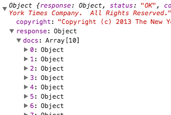

# INTRO TO AJAX
1. Asynchronous JavaScript And XML(AJAX) allows for content retrieval and display without reloading the webpage.
1. Request doesn't block other events from happening. The page only acts on data when it gets returned by the server.
1. AJAX request occurs in several ways (some requires API key). Data returned can be **XML**, **JSON** (more popular these days), or **HTML**.  
1. At **Network** tab in DevTools, use **XHR** to filter AJAX request only.
1. **data** under Headers provides info to the server about specific request.
1. Go to **Preview** to see the data received in collapsed view.
1. `/u003c` is a unicode representations of characters like `<` or `>`.
1. Go to **Response** to see raw response.
1. [JQuery AJAX Documentation](http://api.jquery.com/jquery.ajax/).
1. By default, only url is required to run `JQuery.ajax()`, everything else like settings, success function is optional.
1. [GIANT DATABASE OF APIs](http://www.programmableweb.com/apis/directory).
1. As of 2014, almost 62% of top 100 websites uses JQuery.
1. [Google Streetview API Documentation](https://developers.google.com/maps/documentation/streetview/)
1. There are many instance a site requires you to provide **API Keys**. For instance they might want to limit the rate of your request so they don't get overwhelmed.
1. Another thing is authentications. Services like Facebook and Twitter use **OAuth** to authenticate users. They only want people with accounts to be able to get data since that data is often not publicly accessible.
1. Handling JSON example:
```JavaScript
$.getJSON("example.json", function() {
  alert("success");
})
.success(function() { alert("second success"); })
.error(function() { alert("error"); })
.complete(function() { alert("complete"); });
```
1. Information about [Cross-Origin Resource Sharing(CORS)](https://en.wikipedia.org/wiki/Cross-origin_resource_sharing);
1. For example, making normal JSON requests to Wikipedia will result in a cross origin or a cross-site error, because Wikipedia servers forbid cross origin requests.
1. To get around it:
  1. Set the origin and the content type headers on the request.
  1. Use JSON-P - involves a server wrapping response inside a function to get injected when it actually gets back to the client. To make a JSON-P request, use the more robust `.ajax()` method.

1. Simple example of the difference between JSON and JSONP [here](http://json-jsonp-tutorial.craic.com/index.html).
1. Error handling for JSONP - not built in. This is a technical limitation because of what's happening behind the scenes. One way to work around it: use `setTimeout` function for error handling (set it to about 8 seconds). Then in `.done()` use `clearTimeout` to cancel the `setTimeout` function set earlier.
1. Speeding up the first render, one can:
  1. Request _generic_ HTML
  2. Request _unique_ HTML
  3. Render _generic_ HTML
  4. Render _unique_ HTML

## About JSON
Example JSON from New York Times:

Example:
```JavaScript
var nytUrl = 'https:newyorktimes.com/blahblahblah'

  $.getJSON(nytUrl, function(data){

    // to access articles
    var articles = data.response.docs;

    //to access elements in articles
    for (var i = 0; i < articles.length; i++) {
      var article = articles[i];
      $nytElem.append('<li class="article">' + '<a href="' + article.web_url + '">' + article.headline.main +'</a>'+ '<p>' + article.snippet + '</p>' + '</li>');
    }

  });
```
