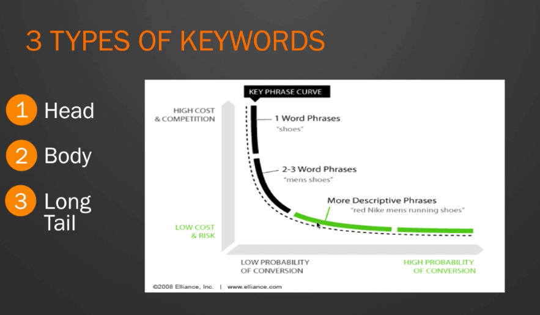

## SEO for Beginners

### General
1. Cost effective marketing strategy:
  1. Targeted: Visitors have specific problems they want to solve
  1. Inbound in Nature: Customer coming to you
  1. Automated: Search engines send visitors 24/7 365

1. Optimisation - Making sure Google understands what keywords you're targeting, what products and services you selling, and where you sell them.
1. Authority - Making sure that Google knows you have the best content for their users.

1. Website vs. Webpages - If a website is a book, webpages are the pages of the book.

1. Google presents the most relevant webpages, not the website.
1. 3 types of keywords:
    1. Head
    1. Body
    1. Longtail
    
1. Use [Google Keyword Planner Tool](g.co/etoaw) - this link allows you to avoid the create campaign and key in billing info steps;

### On Page Optimisation
1. URL Optimisation
  1. Use readable URL's only. Avoid: yourdomain.com/p=123
  1. Have keyword rich URL's e.g. yourdomain.com/target-keyword
  1. Keep URL's short. Avoid: yourdomain.com/target-keyword-is-the-greatest-thing-ever
1. Title Tag:
  1. most important, front load keyword in search tag e.g. Home Insurance by 123.ie
  1. 55 characters and below
  1. Different title tag for every page - will affect rankings
1. Meta Description:
  1. Action oriented words e.g. Protect your home with 123.ie
  1. Use keywords
  1. Under 155 characters
### Off Page Optimisation: Link Building
1.  Google sees a link to your site as a vote of confidence that your content is great and you're an authority/ trusted entity.
1. Not all back links are created equal.
1. Type of links that really matter:
  1. Link from webpages relevant to your niche - like a drone site should have drone related links.
  1. Link from a ranking webpage - somebody who already got a lot of authority
  1. Links with effective anchor text "click here" - use brand name or keywords
  1. Consistent backlinks
1. How to get links: earn naturally
  1. Link building is a by product of building something genuinely worth linking to, whether it's your products, service, the content you produce or the opinions your share with your industry and peers.
  1. A.K.A an "editorial link" is a one-way link placed within the body of a content that is given naturally by other websites to specify a resource
  1. Basically, it's a form of citation on the web, which generally indicates that the destination of the link is the original source of the procured data, idea, concept or statement.
1. How to get links: manual outreach
  1. Manual "Outreach" Link Building: create these links by emailing bloggers/ webmasters for links.
  1. Great way to develop link opportunities, draw attention to new content and maximise links for content campaigns.
  1. Create a value proposition by explaining to the link target why creating the link is in their best interest.
1. Black Hat SEO - Are paid links worth the risk?
  1. Create links through blog comments, forum signatures, PR directories or user profiles, directories etc.
  1. These links offer the lowest value. Unlikely to be from authority sites in your niche.
  1. Recent updates to Google's algorithm means a site can be penalized or suppressed if they have engaged in manipulative link building.
  1. Ahrefs.com - backlink checker
1. SEO for local businesses
  1. Search keyword for places within your proximity e.g. burger restaurant
  1. Google checks if the site is mobile friendly: most people search with their phones
  1. Google local pack - places results
