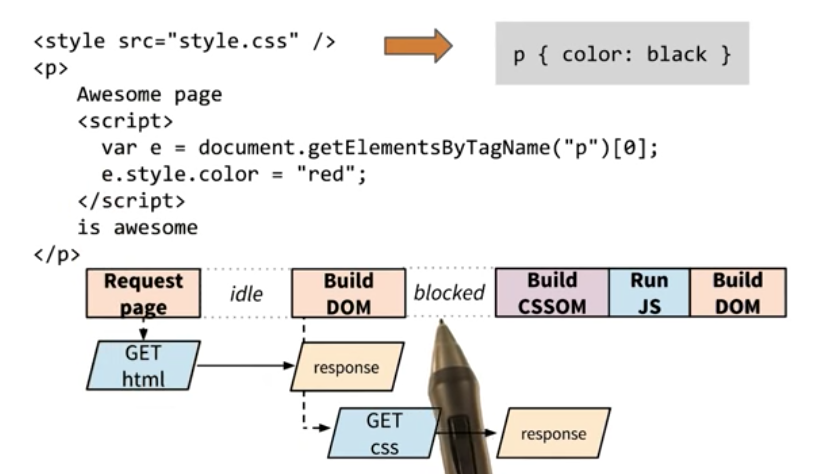

# Website Performance Optimization

## The Critical Rendering Path
* The **Critical Rendering Path (CRP)** is the series of steps the browser goes through to convert to the HTML, CSS and JavaScript into actual pixels on the screen.
* Learn more about CRP on Google's [Web Fundamentals](https://developers.google.com/web/fundamentals/performance/critical-rendering-path/)
### Converting HTML to DOM:
* Browser sends request to server, browser process HTML markups and build the DOM. When the browser encounters a tag e.g. `<html>`, `<head>`, browser creates a token.  If a start tag comes before the end tag of another start tag, this means it's the child of the latter tag.
  * HTML response -> Tokens -> Nodes -> DOM Tree
* The DOM constructs the DOM incrementally, hence you can take advantage of this to speed up the rendering. **Incremental HTML Delivery**
* : Google Search: when you send a search request to Google, before the server what search results are, it immediately returns the header of the page, this allow the browser to start processing the response and begin constructing the DOM incrementally. Then once the search result is ready the rest of the HTML arrives and the browser displays the contents.
* A single DOM node starts with a startTag and ends with a endTag. Between the start and the endTag comes other tokens which will define one DOM node.
* Nodes contain all relevant information about the HTML element.
* Nodes are connected into a DOM tree based on token hierarchy.
### Converting CSS to the CSSOM
* Similarly, parser converts tokens to nodes.
* Children will inherit parent rule. This is what is known as cascading rule / cascading style sheet.
* We can't use partial CSSOM tree to optimize page rendering because it will lead rendering the wrong styles e.g. if a style rule comes later. This is known as **Render Blocking**.
* More specific tags requires more work. i.e. rendering `h1 {}` style rules is faster than `div p {}`.

### The Render Tree
* The render tree only captures visible content. E.g. if a css of an element is `display: none;`, then the element and it's children will not be included in the render tree. More on [Render Tree Construction](https://developers.google.com/web/fundamentals/performance/critical-rendering-path/render-tree-construction) by Google.

### Layout
* Specifying `width` and `height` as 50% means it is 50% of the layout viewport size.
* The viewport meta that specifies the layout viewport should be equal to the device width. If this is not provided the browser will use the default viewport width which is 980 pixels.:
  `<meta name="viewport" content="width=device-width">`
* Browser has to rerun layout when dimension changed. E.g. rotating the phone or even resize the browser.

### Paint
* Not all pixels cost the same to paint.
* Measure first, optimize later.

### Rendering an HTML document
```html
<!DOCTYPE html>
<head>
  <link rel="stylesheet" href="/css/master.css" media="screen" title="no title" charset="utf-8">
  <script src="js/app.js" charset="utf-8"></script>
</head>
<body>
  ...
</body>
```
1. Begin constructing the DOM by parsing HTML
2. Request CSS & JS resources
3. Parse CSS and construct the CSSOM tree
4. Execute JS
5. Merge DOM and CSSOM into the Render Tree
6. Run layout, paint

## Optimizing the CRP
### Optimizing HTML and CSS
1. [Minify CSS](https://developers.google.com/speed/pagespeed/service/MinifyCSS).
2. [Inlining critial CSS](https://developers.google.com/speed/pagespeed/service/PrioritizeCriticalCss).
3. Remove comments in production codes.
4. [Resource minification](https://developers.google.com/web/fundamentals/performance/optimizing-content-efficiency/optimize-encoding-and-transfer#minification-preprocessing--context-specific-optimizations).
5. [Text compression with GZIP](https://developers.google.com/web/fundamentals/performance/optimizing-content-efficiency/optimize-encoding-and-transfer#text-compression-with-gzip).
6. [HTTP caching](https://developers.google.com/web/fundamentals/performance/optimizing-content-efficiency/http-caching).
7. [Avoid render blocking CSS](https://developers.google.com/web/fundamentals/performance/critical-rendering-path/render-blocking-css).
8. [Responsive Web Design Basics](https://developers.google.com/web/fundamentals/design-and-ui/responsive/fundamentals/).
9. Don't block rendering on the `@media print {}` rules since it only applies when the user wants to print. Split it into a separate file i.e. `print.css` and link it like this:
```html
<link rel="stylesheet" href="/css/print.css" media="print">
```
10. The above technique also works with multiple breakpoints.

### JavaScript and CRP
1. When encountering a script tag within an HTML script, we need to pause the DOM construction. Hence JavaScript is said to be **Parser Blocking**. This can be a problem if the script is asking from a source file (**External JavaScript Dependencies**), depending on the time to get the file, it stops construction of the DOM, which in turn slows down the CRP.
2. [Adding interactivity with JavaScript](https://developers.google.com/web/fundamentals/performance/critical-rendering-path/adding-interactivity-with-javascript).
3. 
4. CSS blocks rendering and JavaScript Execution. Optimizing CSS is important!
5. Scripts (like analytics) that don't modify the DOM or CSSOM shouldn't block rendering.
6. `window.onload` event happens after the file finish loading, hence execute JavaScript after this is a good strategy.
7. Or use `async` attribute, this works too!
8. Inline script will always block CSSOM, with one exception: if the JavaScript is put above your CSS, then it will execute without blocking on CSS.
9. [The script defer attribute](https://hacks.mozilla.org/2009/06/defer/).
10. [Parser blocking vs. asynchronous JavaScript](https://developers.google.com/web/fundamentals/performance/critical-rendering-path/adding-interactivity-with-javascript#parser-blocking-vs-asynchronous-javascript).

### General Strategies and CRP Diagram
1. Minify, Compress, Cache
  * HTML, CSS, JavaScript
2. Minimize use of render blocking resources
  * Use media queries on `<link>` to unblock rendering
  * Inline CSS
3. Minimize use of parser blocking resources
  * Defer JavaScript execution
  * Use `async` attribute on `<script>`
4. [Optimizing critical rendering path](https://developers.google.com/web/fundamentals/performance/critical-rendering-path/optimizing-critical-rendering-path).
5. [Analyzing critical rendering path performance](https://developers.google.com/web/fundamentals/performance/critical-rendering-path/analyzing-crp#performance-patterns)
6. Generally:
  1. Minimize Bytes
  2. Reduce critical resources
  3. Shorten CRP length
7. Page should ideally be small(ideally under 14kb) to minimize the round trip to go fetch data.
8. Ilya Grigorik's book on [High Performance Browser Networking](https://hpbn.co/).
9. Critical Path Matrix: 
10. Preload scanner helps download all JavaScript files such that the browser doesn't have to build CSSOM, run JS and the do it all over again when it encounters a new JS file. More on [Preload Scanner](http://andydavies.me/blog/2013/10/22/how-the-browser-pre-loader-makes-pages-load-faster/)
11. Love bao
